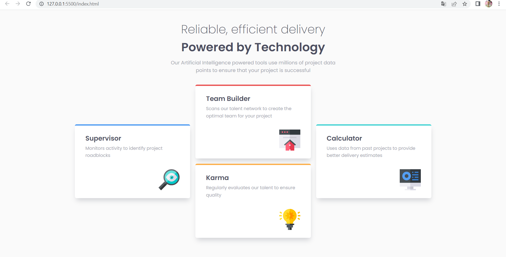

# Frontend Mentor - Four card feature section solution

This is a solution to the [Four card feature section challenge on Frontend Mentor](https://www.frontendmentor.io/challenges/four-card-feature-section-weK1eFYK). Frontend Mentor challenges help you improve your coding skills by building realistic projects. 

## Table of contents

- [Overview](#overview)
  - [The challenge](#the-challenge)
  - [Screenshot](#screenshot)
  - [Links](#links)
- [My process](#my-process)
  - [Built with](#built-with)
  - [What I learned](#what-i-learned)
- [Author](#author)

## Overview

### The challenge

Users should be able to:

- View the optimal layout for the site depending on their device's screen size

### Screenshot

### Links

- Solution URL: [https://github.com/KaisBoulakhlas/four-card-components.git]
- Live Site URL: [https://four-card-component-grid.netlify.app](https://your-live-site-url.com)

## My process

### Built with

- CSS custom properties
- Flexbox
- CSS Grid

### What I learned

I learn a lot of on grid layout with display:grid. In my habits, i use flexbox but grid is amazing too. I will use a mixture of both now.

## Author

- Frontend Mentor - [@KaisBoulakhlas](https://www.frontendmentor.io/profile/KaisBoulakhlas)
